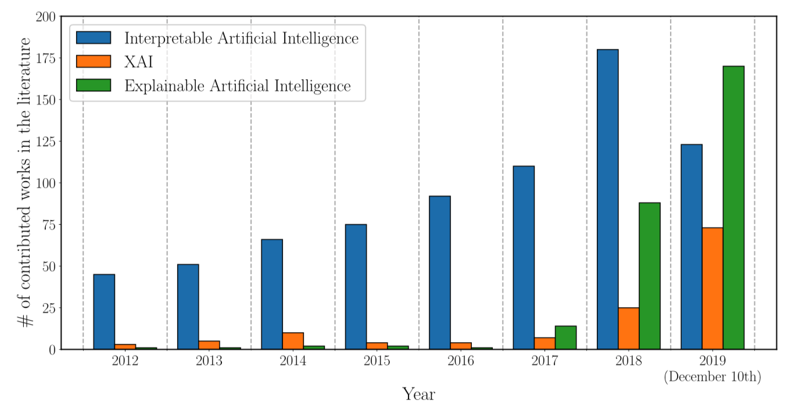

```{r setup, include=FALSE}
knitr::opts_chunk$set(echo = TRUE)
```

# Motivation

Propelled by advancements in modern computer technology and the increasing availability of big data, deep learning has re-emerged as perhaps the most promising artificial intelligence (AI) technology of the last two decades. By treating problems as a nested, hierarchy of hidden layers deep artificial neural networks achieve the power an flexibility necessary to for AI systems to navigate in complex real-world environments. Unfortunately, their very nature has earned them a reputation as *Black Box* algorithms and their lack of interpretability remains a major impediment to their more wide-spread application.

In science, research questions usually demand not just answers but also explanations and variable selection is often as important as prediction [@ish2019interpreting]. Economists, for example, have long since recognised the undeniable potential of deep learning, but are rightly hesitant to employ novel tools that are not fully transparent and ultimately cannot be trusted. Similarly, real-world applications of AI have come under increasing scrutiny with regulators proposing that individuals influenced by algorithms should have the right to obtain explanations [@fan2020interpretability]. In high-risk decision-making fields such as AI systems that drive autonomous vehicles the need for explanations in case things go wrong is self-evident [@ish2019interpreting].

In light of these challenges it is not surprising that research on explainable AI has recently gained considerable momentum (Figure \@ref(fig:ai-research)). While in this short essay we will focus on deep learning in particular, it should be noted that this growing body of literature is concerned with a broader realm of machine learning models. The rest of this note is structured as follows: section \@ref(interpretable-dl) provides a brief overview recent advancements towards interpreting deep neural networks largely drawing on @fan2020interpretability; section \@ref(rate) considers a novel approach towards interpretability in the context of Gaussian processes proposed by @crawford2019variable; finally, in section \@ref(interpreting-bnns) we will see how this approach can be applied to deep neural networks as proposed in @ish2019interpreting.

{#fig:ai-research width="500"}

# Interpretable DL - a whistle-stop tour {#interpretable-dl}

Before delving further into *how* how the intrinsics of deep neural networks can be disentangled and interpreted we should fist clarify *what* interpretability actually means in the context of algorithmic models. @fan2020interpretability describes model interpretability simply as the extent to which humans can "understand and reason" the model. This may concern an understanding of both the *ad-hoc* workings of the algorithm and the *post-hoc* interpretability of its output. In the context of linear regression, for example, *ad-hoc* workings of the model are often described through intuitive of idea of linearly projecting the outcome variable $\mathbf{y}$ onto the column space of $\mathbf{X}$. *Post-hoc* interpretations usually center around variable importance -- the main focus of the following sections. We will see now that various recent advancements tackle interpretability of DNNs from different angles depending on whether *ad-hoc* or *post-hoc* interpretability is the primary goal. @fan2020interpretability further asses that model interpretability hinges on three main aspects of *simulatability*, *decomposability* and *algorithmic transparency*, but for the purpose of this short essay the *ad-hoc* vs. *post-hoc* taxonomy provides a simpler more natural framework. [^1]

[^1]: Simulatability describes the overall, high-level understandability of the mechanisms underlying the model -- put simply, the less complex the model, the higher its simulatability. Decomposability concerns the extent to which the model can be taken apart into smaller pieces -- neural networks by there very nature are compositions of multiple layers. Finally, algorithmic transparency refers to the extent to which the training of the algorithm is well-understood and to some extent observable -- since DNNs generally deal with optimization of non-convex functions and often lack unique solution they are inherently intransparent.

Understanding the *ad-hoc* intrinsic mechanisms of a DNN is inherently difficult. While generally transparency may be preserved in the presence of nonlinearity (e.g. decision trees), multiple hidden layers of networks each involving nonlinear operations are usually out of the realm of human comprehension [@fan2020interpretability]. Training also generally involves optimization of non-convex functions that involve an increasing number of saddle points as the dimensionality increases [@fan2020interpretability]. Nonlinearity may not necessarily result in opacity (for example, a decision tree model is not linear but interpretable), but in deep learning, a series of nonlinear operations indeed prevents us from understanding the inner working of neural networks.[@fan2020interpretability]

Methods to circumvent this problematic usually boil down to decreasing the overall complexity, either by regularizing the model or through proxy methods. Regularization -- while traditionally done to avoid overfitting -- has been found the be useful to create more interpretable representations. Monotonicity constraints, for example, impose that as the value of the a specified covariate increases model predictions either monotonically decrease of increase. Proxy methods construct simpler representations of a learned DNN, such as a decision tree. This essentially involves repeatedly querying the trained network while varying the inputs and then derive decision rules based on the model output.

Post-hoc interpretability usually revolves around the understanding of feature importance. A greedy approach to this question is to simply remove features one by one and check how model predictions change. A more sophisticated approach along these lines is *Shapley* value, whihc draws on cooperative game theory. The Shapley value assigns varying payouts to players depending on their contribution to overall payout. In the context of neural networks input covariate $\mathbf{X}_p$ represents a player while overall payout is represented by the difference between average and individual outcome predictions.[^2] Exact computations of Shapley values are prohibitive as the dimensionality increases, though approximate methods have been recently [@fan2020interpretability].

[^2]: For more detail see for example [here](https://christophm.github.io/interpretable-ml-book/shapley.html)

The remainder of this note focuses on a novel approach to feature extraction that measures entropy shifts in a learned probabilistic neural network in response to the model inputs $\mathbf{X_1},...,\mathbf{X}_P$. We will first introduce this methodology in the context of Gaussian processes in the following section before finally turning to its application to Bayesian neural networks.

# An entropy-based approach to variable importance {#rate}

## From Bayes to Gaussian Process regression

[@ish2019interpreting] motivate their methodology for interpreting neural networks through Gaussian Process regression. Consider the following Bayesian regression model with Gaussian priors:

```{=tex}
\begin{equation}
\begin{aligned}
&& f(\mathbf{X}|\mathbf{w})&=\phi(\mathbf{X})^T\mathbf{w} + \varepsilon, &&\varepsilon \sim \mathcal{N}(0,\mathbf{I}) \\
&& \mathbf{w}& \sim \mathcal{N}(0,{1\over{\lambda}} \mathbf{I})\\
\end{aligned}
(\#eq:bayes)
\end{equation}
```
This naturally gives rise to a particular example of a Gaussian Process (GP). In particular, since $\mathbf{u}(\mathbf{X})=\Phi(\mathbf{X})^T\mathbf{w}$ is just a linear combination fo Gaussian random variables it follows a Gaussian process itself

```{=tex}
\begin{equation}
\begin{aligned}
&& \mathbf{u}(\mathbf{X})=\Phi(\mathbf{X})^T\mathbf{w}& \sim \mathcal{N}(\mathbf{0}, \mathbf{K}) \\
\end{aligned}
(\#eq:khbs)
\end{equation}
```
where $\mathbf{K}$ is the Kernel (or Gram) matrix and $K_{i,j}=k(\mathbf{X_i,\mathbf{X}_j})={1\over{\lambda}}\phi(\mathbf{X_i})^T\phi(\mathbf{X_m})$ is the kernel function [@bishop2006pattern]. That is, the prior distribution over $\mathbf{w}$ induces a probability distribution over random functions $\mathbf{u}(\mathbf{X})$. The GP can therefore alternatively be understood as a prior distribution over a an infinite-dimensional reproducible kernel Hilbert space (RKHS) [@crawford2019variable], which in a finite-dimensional setting becomes multivariate Gaussian.

In a standard linear model regression coefficients characterize the projection of the outcome variable $\mathbf{y}$ onto the column space of the regressors $\mathbf{X}$, in particular with ordinary least square we define:

```{=tex}
\begin{equation}
\begin{aligned}
&& \beta&=(\mathbf{X}^T\mathbf{X})^{-1}\mathbf{X}^T\mathbf{y} \\
\end{aligned}
(\#eq:ols)
\end{equation}
```
In other words, the primary focus here is to learn the mapping from input to output. The key differentiating feature between this approach and the non-parametric model in \@ref(eq:bayes) is the fact that in case of the latter we are interested in learning not only the mapping from inputs to outputs, but also the representation ($\mathbf{u}(\mathbf{X})$) of the inputs (see for example [@goodfellow2016deep]). To be even more specific, treating the feature representation itself as random allows as in \@ref(eq:bayes) allows us to learn non-linear relationship between the covariates $\mathbf{X}$, since they are implicitly captured by the RKHS [@crawford2019variable]. Neural networks share this architecture and hence it is worth dwelling on it a bit further: the fact that the learned model inherently incorporates variable interactions leads to the observation that an individual feature is rarely important on its own with respect to the mapping from $\mathbf{X}$ to $\mathbf{y}$ [@ish2019interpreting]. Hence, in order to gain an understanding of individual variable importance, one should aim to understand what role feature $\mathbf{X}_j$ plays *within* the learned model, thereby taking into account its interactions with other covariates. Formally, @crawford2019variable and define the *effect size analogue* as the equivalent of the familiar regression coefficient in the non-parametric setting

```{=tex}
\begin{equation}
\begin{aligned}
&& \tilde\beta&=\mathbf{X}^+\Phi^T\mathbf{w}=\mathbf{X}^+\mathbf{u} \\
\end{aligned}
(\#eq:effect-size)
\end{equation}
```
where $\mathbf{X}^+=\lim_{\alpha} (\mathbf{X}^T\mathbf{X}+\alpha \mathbf{I})^{-1}\mathbf{X}^T$ denotes the Moore-Penrose pseudo-inverse (see for example @goodfellow2016deep). Intuitively the effect size analogue can be thought of as the resulting coefficients from regressing the fitted values $\hat{\mathbf{u}}$ from the learned probabilistic model on the covariates $\mathbf{X}$. it can be interpreted in the same way as linear regression coefficients, in that $\tilde\beta_j$ describes the marginal change in $\mathbf{u}$ given a unit increase in $\mathbf{X}_j$ holding all else constant. Note here the subtle, but crucial difference between \@ref(eq:ols) -- a projection from the outcome variable onto the column space of $\mathbf{X}$ -- and \@ref(eq:effect-size) -- a projection from the learned model to $\mathbf{X}$. In other words, looking at $\tilde\beta$ can be thought of as shining a light directly into the *Block Box*. Unfortunately, as @crawford2019variable point out working with \@ref(eq:effect-size) is usually not straight-forward. From a practitioner's point of view, it is also not obvious how to interpret a coefficient that describes marginal effects of input variables on the expected value of a learned model. A more useful indicator in this context would provide a measure of how much individual variables contribute to the overall variation in the learned model. For this purpose @crawford2019variable instead propose to work with a distributional centrality measure based on $\tilde\beta$, which we shall turn to in the following section.

## RATE

The proposed methodology in @crawford2019variable and @ish2019interpreting depends on the availability of a posterior distribution over $\tilde\beta$ in that it measures its entropic shifts in response to the introduction of covariates. The intuition is straight-forward: within the context of the learned probabilistic model is covariate $\mathbf{X_j}$ informative or not? More formally this boils down to determining if the posterior distribution of $p(\tilde\beta_{-j})$ is dependent on the effect of $\tilde\beta_j$ or not. This can be quantified through the Kullback-Leibler divergence (KLD) between $p(\tilde\beta_{-j})$ and the conditional posterior $p(\tilde\beta_{-j}|\tilde\beta_j)$:

```{=tex}
\begin{equation} 
\begin{aligned}
&& \text{KLD}_j&=\text{KL}\left(p(\tilde\beta_{-j}) || p(\tilde\beta_{-j}|\tilde\beta_j)\right) \\
\end{aligned}
(\#eq:kld)
\end{equation}
```
Covariates that contribute significant information to the model will have $\text{KLD}>0$, while for insignificant covariates $\text{KLD}\approx0$. The measure of induced entropy change gives rise to a ranking of the covariates in terms of their relative importance in the model. The RATE criterion of variable $\mathbf{X}_j$ is simply defined as

```{=tex}
\begin{equation} 
\begin{aligned}
&& \gamma_j&=\frac{\text{KLD}_j}{\sum_{p=1}^{P}\text{KLD}_p}\in[0,1] \\
\end{aligned}
(\#eq:rate)
\end{equation}
```
which in light of its bounds can naturally be interpreted as $\mathbf{X}_j$\`s percentage contribution to the learned model. It is worth noting that $p(\tilde\beta_{-j}|\tilde\beta_j)$ of course depends on the value of the conditioning variable. A natural choice is $\tilde\beta_j=0$ which usually corresponds to the null hypothesis.

# Application to Bayesian neural networks {#interpreting-bnns}

The applicability of RATE naturally depends on the availability of a posterior parameter distribution to draw from. Hence, in order to use this approach in the context of deep learning we need to work in the Bayesian setting. Contrary to standard artificial neural networks which work under the assumption that weights have some true latent value, Bayesian neural networks place a prior distribution over network parameters and hence treat the weights themselves as random variables [@goan2020bayesian]. Not only does it perhaps seem more natural to treat latent variables as random, but the Bayesian setting also naturally gives rise to reason about uncertainty in predictions, which can ultimately help us develop more trustworthy models [@goan2020bayesian]. A drawback of BNNs is that exact computation of posterior parameters distribution and inference is computationally challenging and often intractable.

When the prior placed over parameters is Gaussian, the output of the BNN approaches a Gaussian process as the width of the network grows, in line with the discussion in the previous section. 

# Conclusion

-   RATE will enable scientists to consider embracing machine learning-type approaches by allowing them to open up the black box [@crawford2019variable].

\pagebreak

# References {-}

<div id="refs"></div>

\pagebreak

# (APPENDIX) Appendix {#appendix -}

Simple MLP with single-layer

```{=tex}
\begin{equation}
\begin{aligned}
&& z_m(\mathbf{X})&= \sum_{i=1}^{k} a(x_iw_{ji}^{(1)}) \\
\end{aligned}
(\#eq:name)
\end{equation}
```

# Probabilities

Joint distribution defined as

```{=tex}
\begin{equation}
\begin{aligned}
&& p(\mathbf{w},\mathcal{D})&=p(\mathbf{w})p(\mathcal{D}|\mathbf{w}) \\
\end{aligned}
(\#eq:joint_dist)
\end{equation}
```
where for the likelihood it is common to assume that samples from $\mathcal{D}$ are i.i.d. and hence we have

```{=tex}
\begin{equation}
\begin{aligned}
&& p(\mathcal{D}|\mathbf{w})&= \prod_{i=1}^N \sim \mathcal{N} (\mathbf{f}(x_i),\sigma_i) \\
\end{aligned}
(\#eq:likeli)
\end{equation}
```
with $\mathbf{f}(x_i)$ the mean value specified by the output of the network. It is also common to assume a zero mean Gaussian with a small variance for our prior. Applying Bayes' theorem then yields

```{=tex}
\begin{equation}
\begin{aligned}
&& \pi(\mathbf{w}|\mathcal{D})&= \frac{p(\mathbf{w})p(\mathcal{D}|\mathbf{w})}{ \int p(\mathbf{w})p(\mathcal{D}|\mathbf{w}) d \mathbf{w}} = \frac{p(\mathbf{w})p(\mathcal{D}|\mathbf{w})}{p(\mathcal{D})}\\
\end{aligned}
(\#eq:bayes)
\end{equation}
```
Predictions for the outcome variable will then be an expectation fo the posterior

```{=tex}
\begin{equation}
\begin{aligned}
&& \mathbb{E}_{\pi} \left( \mathbf{f} \right)&= \int \mathbf{f}(\mathbf{w})\pi(\mathbf{w}|\mathcal{D}) d \mathbf{w} \\
\end{aligned}
(\#eq:predict)
\end{equation}
```
-   Prediction can then be viewed as an average of the function f weighted by the posterior. It also provides a natural setting for confidence intervals around the predictions.

# Estimating predictive moments

## Variational inference

-   This type of non-convex optimisation can be viewed in a Bayesian context through the lens of Variational Inference [@goan2020bayesian]

-   VI is based on the idea to assume a suitable family of posterior distributions and then minimize the KL divergence between the true posterior and the variational posterior.

-   Usually depends on imposing strong restrictions on the posterior.

-   Modern approaches use SGD to optimize the variational objective.

## Markov Cain Monte Carlo

-   MCMC simply approximates the expectation of the posterior through repeated draws from the posterior distribution:

```{=tex}
\begin{equation}
\begin{aligned}
&& \mathbb{E}_{\pi} \left( \mathbf{f} \right)&= \int \mathbf{f}(\mathbf{w})\pi(\mathbf{w}|\mathcal{D}) d \mathbf{w} \approx {1\over{N}} \sum_{i=1}^{N}
\mathbf{f}(\mathbf{w}) \\
\end{aligned}
(\#eq:mcmc)
\end{equation}
```
-   MCMC enables sampling from our posterior distribution, with the samples converging to when the product of the probability density and volume are greatest [@goan2020bayesian]
-   MCMC provides convergence to the true posterior as the number of samples approaches infinity.
