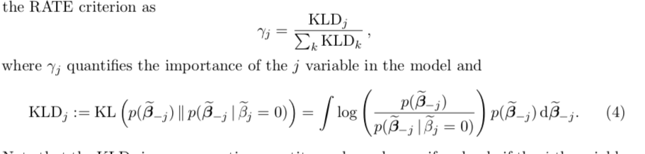
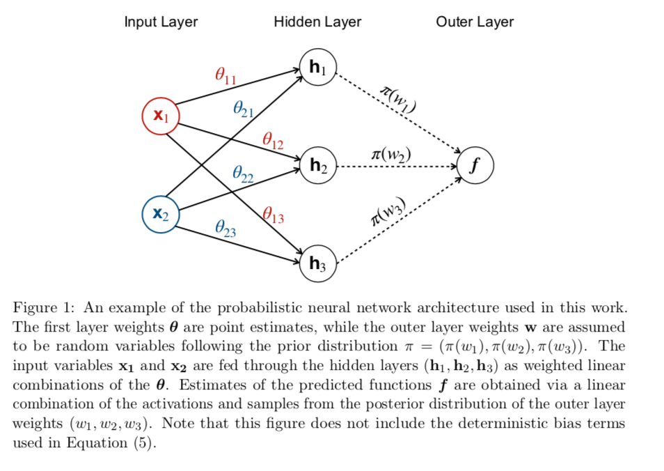

```{r setup, include=FALSE}
knitr::opts_chunk$set(echo = TRUE)
```

## Structure

1.  Quick review of different interpretability approaches drawing on [@fan2020interpretability] mainly.

    -   Place RATE into that review -- *global* vs *local*

2.  The RATE methodology [@ish2019interpreting]

    -   What is a Bayesian NN (draw on Chapter 16[@goodfellow2016deep] and [@goan2020bayesian]) and the RATE method for BNNs [@ish2019interpreting]

3.  A simple coding example

    -   Use the code from paper for simple example

## Neural network interpretability - a whistle-stop tour

### The 'Black Box' nature of neural networks

-   With NNs being a statistical black-box, interpretation and explanation of the decision making process eludes current theory [@goan2020bayesian]. ... Bayesian statistics offers natural way to reason about uncertainty in predictions, and can provide insight into how these decisions are made.

-   The distribution over outputs provided by probabilistic methods allows for the development of trustworthy models, in that they can identify uncertainty in a prediction. [@goan2020bayesian]

-   Some researchers only focus on post-hoc explanations with models given a priori, while some focus only on the interplay mechanism between algorithmic machineries [@fan2020interpretability]

-   Simulatability is considered as the understanding built over the entire model [@fan2020interpretability]

-   Decomposability is to understand the model in terms of its components: neurons, layers, blocks and so on. [@fan2020interpretability]

-   Algorithmic Transparency is to understand the training algorithm... The landscape of the objective function of a neural network is highly non-convex. The fact that deep models do not have the unique solution in general hurts the model transparency. [@fan2020interpretability]

-   it is commonly seen that some practitioners accept the outcome from deep learning without any doubt [@fan2020interpretability]

-   Nowadays, deep learning has been extensively used in tackling intricate problems, which even professionals are unable to comprehend adequately. [@fan2020interpretability]

-   Highly heterogenous and complex data hamper not only the accuracy of deep learning but also the construction of interpretability [@fan2020interpretability]

-   Deep learning is a kind of large-scale, highly nonlinear algorithms. Convolution, pooling, nonlinear activation, shortcuts and so on contribute to variability of neural networks. [@fan2020interpretability]

-   Nonlinearity may not necessarily result in opacity (for example, a decision tree model is not linear but interpretable), but in deep learning, a series of nonlinear operations indeed prevents us from understanding the inner working of neural networks.[@fan2020interpretability]

-   The ability to explain or to present in understandable terms to a human. [@ish2019interpreting]

### Implications

-   The lack of interpretability has become a main barrier of deep learning in its wide-spread applications.

-   Whenever support vector machines or neural networks give meaningful performance gains over more conventional regression models, a challenge of interpretability arises. In these situations, it is often questioned what characteristics of the input data are being most used by the black box. [@crawford2019variable]

-   The regularizations of European Union were proposed in 2016 that individuals influenced by algorithms have the right to obtain explanation [@fan2020interpretability].

-   DNNs have not been widely adopted in scientific settings, where variable selection tasks are often as important as prediction [@ish2019interpreting].

-   While DNNs are beginning to be used in high-risk decision-making fields (e.g., automated medical diagnostics or self-driving cars (Lundervold and Lundervold, 2019)), it is critically important that methods do not make predictions based on artefacts or biases in the training data. [@ish2019interpreting]

### Modest advancements

#### Global interpretability

-   In the context of neural networks, a feature is rarely important on its own, so our strategy is specifically designed to leverage partial covariance structures and incorporate variable interactions into our proposed feature ranking. [@ish2019interpreting]

-   Here, we describe an approach to interpret deep neural networks using "RelATive cEntrality" (RATE) (Crawford et al., 2019), a recently-proposed variable importance criterion for Bayesian models. [@ish2019interpreting]

-   Most work on DNNs has centered around locally interpretable methods with the goal to explain specific classification decisions with respect to input features.[@ish2019interpreting] We focus instead on **global interpretability** where the goal is to identify predictor variables that best explain the overall performance of a trained model.

-   Previous work in this context have attempted to solve this issue by selecting inputs that maximize the activation of each layer within the network [@ish2019interpreting].

-   Another viable approach for achieving global interpretability is to train more conventional statistical methods to mimic the predictive behavior of a DNN. [@ish2019interpreting] Unfortunately, these simple models can struggle to mimic the accuracy of DNNs effectively.

-   The ability to establish variable importance in random forests is a significant reason for their popularity in fields such as the life and clinical sciences. A notable drawback of RFs and GBMs is that it can take a significant amount of training time to achieve accuracy comparable to the DNNs that they serve to mimic [@ish2019interpreting].

#### Overview

-   exactness, consistency -- for multiple similar samples, a fair interpretation should produce consistent answers --, completeness, universality -- a universal interpreter that can decipher different models --, and reward [@fan2020interpretability]

    

##### Understanding models

###### Feature analysis

-   Model inversion -- representation usually not easily invertible but can be approximated:

    $$
    {\text{arg}\min}_x || \Omega(x) - \Omega(x_0)||^2 + \lambda R(x)
    $$

-   As a side note, the limits of feature analysis methods are that they can only provide qualitative and superficial explanations [@fan2020interpretability]

###### Model inspection methods

-   Partial dependence plots (PDP) and individual condition expectations (ICE) -- both basically just keeping some inputs fixed and letting others vary [@fan2020interpretability]

-   Compared with Feature Analysis methods, Model Inspection methods are technically more accountable because analytical tools are directly involved for the analysis.

###### Saliency methods

-   **Saliency Methods** show which part of images or which attribute of input data is most relevant to the prediction or latent representations of the model [@fan2020interpretability]

-   A good example to justify the utility of a saliency map is how a model successfully predicts the "polar bear" instances. If the polar bear always appears in the picture coupled with snow or ice, the model may misuse the information of snow to make inference rather than the features pertaining to the polar bear. [@fan2020interpretability]

-   A naive approach is to take advantage of the change of prediction when removing one feature to probe the importance of the corresponding feature [@fan2020interpretability]

    -   For example, in a house loan decision system, race should not be a factor for decision-making. However solely cancelling the "race" factor is not sufficient because some remaining factors such as "zipcode" are highly related with "race".

-   **Shapley value** quantifies the individual contribution of feature $i$

-   Given the prohibitive computational cost incurred by combinatorial explosion, to exactly compute the Shapley value, Ancona et al. (2019) proposed a novel and polynomial-time approximation of Shapley values, which computes the expected value of a random coalition rather than enumerating each of them. [@fan2020interpretability]

-   Layer-wise relevance propagation (LRP) to compute the relevance of one attribute to the prediction by assuming the prediction function \$f(x)\$ can be decomposed as the sum of pixel-wise relevance $R_l^p$.

-   Saliency Methods are useful in understanding the relationship between the network' prediction and the input attributes but they do not directly unlock the mechanism of a network by which it produces its prediction.

###### Proxy methods

-   Proxy Methods construct a simpler and more interpretable proxies for a trained large, complex and black-box deep learning system.

-   Setiono and Liu (1995) clustered hidden unit activations based on the proximity of activation values. Then, the activation values of each cluster were denoted by their average activation value, so that the accuracy of the neural network keeps as intact as possible. Next, the inlet data with the same hidden unit activations were clustered together to obtain a complete set of rules.

-   **Local explainers:** The basic assumption is that when a neural network is inspected globally, it seems so complex and complicated. However, if we look at it locally, the picture becomes clearer.

###### Explaining-by-case

-   case-based explanations present users the cases that are believed by the neural network to be most similar to the query case needing an explanation

##### Understanding training

-   Very hard as the non-convex optimization is very difficult and involves many saddle points. Number of saddle points increases with dimensionality. [@fan2020interpretability]

##### Learning more interpretable representations

###### Regularization

-   Use regularization -- traditionally done to avoid overfitting, but now used to create more interpretable representations

-   Incorporating monotonicity constraints (S. You et al., 2017) is also useful to enhance interpretability. When models are regularized by the monotonicity constraints, the models will be easier to understand. A monotonical relationship means when the value of a specified attribute increases, the predictive value of the model either increases or decreases. [@fan2020interpretability]

###### Model renovation

-   manually design (renovate) the particular machineries of networks to facilitate the interpretability

-   L. Chu et al. (2018) proposed to use piecewise linear functions as activations for the neural network (PLNN)

-   Similarly, Vaughan et al. (2018) designed the network structure to compatibly learn the function formulated as which is more interpretable than general networks, because such a function has simpler partial derivatives that can simplify saliency analysis, statistical analysis and so on.

## Bayesian NNs and the RATE methodology

### Bayesian Neural Networks

-   A distribution is placed over the network parameters, and the resulting network is then termed a Bayesian Neural Network (BNN). [@goan2020bayesian]

-   More importantly, it was shown that by specifying a prior over the network weights, Bayes Theorem can be used to obtain an appropriate posterior. [@goan2020bayesian]

-   While standard artificial neural networks often assign high confidence even to incorrect predictions, Bayesian neural networks can more accurately evaluate how likely their predictions are to be correct.

-   The MLP serves as the basis for NNs, with modern architectures such as convolutional networks having an equivalent MLP representation. [@goan2020bayesian]

-   Exact computation remains analytically and computationally intractable for any BNN of interest [@goan2020bayesian]

Simple MLP with single-layer

\begin{equation}
\begin{aligned}
&& z_m(\mathbf{X})&= \sum_{i=1}^{k} a(x_iw_{ji}^{(1)}) \\
\end{aligned}
(\#eq:name)
\end{equation}

-   In the frequentist setting of NN learning, a MLE or MAP estimate is found through the minimisation of a non-convex cost function [@goan2020bayesian]

-   In the frequentist setting presented above, the model weights are not treated as random variables; weights are assumed to have a true value that is just unknown and the data we have seen is treated as a random variable. [@goan2020bayesian]

-   Since we do not know the value for our weights, it seems natural to treat them as a random variable. [@goan2020bayesian]

-   During the "learning" process of BNNs, unknown model weights are inferred based on what we do know or what we can observe. This is the problem of inverse probability, and is solved through the use of Bayes Theorem. [@goan2020bayesian]

#### Probabilities

Joint distribution defined as

\begin{equation}
\begin{aligned}
&& p(\mathbf{w},\mathcal{D})&=p(\mathbf{w})p(\mathcal{D}|\mathbf{w}) \\
\end{aligned}
(\#eq:joint_dist)
\end{equation}

where for the likelihood it is common to assume that samples from $\mathcal{D}$ are i.i.d. and hence we have

\begin{equation}
\begin{aligned}
&& p(\mathcal{D}|\mathbf{w})&= \prod_{i=1}^N \sim \mathcal{N} (\mathbf{f}(x_i),\sigma_i) \\
\end{aligned}
(\#eq:likeli)
\end{equation}

with $\mathbf{f}(x_i)$ the mean value specified by the output of the network. It is also common to assume a zero mean Gaussian with a small variance for our prior. Applying Bayes' theorem then yields

\begin{equation}
\begin{aligned}
&& \pi(\mathbf{w}|\mathcal{D})&= \frac{p(\mathbf{w})p(\mathcal{D}|\mathbf{w})}{ \int p(\mathbf{w})p(\mathcal{D}|\mathbf{w}) d \mathbf{w}} = \frac{p(\mathbf{w})p(\mathcal{D}|\mathbf{w})}{p(\mathcal{D})}\\
\end{aligned}
(\#eq:bayes)
\end{equation}

Predictions for the outcome variable will then be an expectation fo the posterior

\begin{equation}
\begin{aligned}
&& \mathbb{E}_{\pi} \left( \mathbf{f} \right)&= \int \mathbf{f}(\mathbf{w})\pi(\mathbf{w}|\mathcal{D}) d \mathbf{w} \\
\end{aligned}
(\#eq:predict)
\end{equation}

-   Prediction can then be viewed as an average of the function f weighted by the posterior. It also provides a natural setting for confidence intervals around the predictions.

#### Estimating predictive moments

##### Variational inference

-   This type of non-convex optimisation can be viewed in a Bayesian context through the lens of Variational Inference [@goan2020bayesian]

-   VI is based on the idea to assume a suitable family of posterior distributions and then minimize the KL divergence between the true posterior and the variational posterior.

-   Usually depends on imposing strong restrictions on the posterior.

-   Modern approaches use SGD to optimize the variational objective.

##### Markov Cain Monte Carlo

-   MCMC simply approximates the expectation of the posterior through repeated draws from the posterior distribution:

\begin{equation}
\begin{aligned}
&& \mathbb{E}_{\pi} \left( \mathbf{f} \right)&= \int \mathbf{f}(\mathbf{w})\pi(\mathbf{w}|\mathcal{D}) d \mathbf{w} \approx {1\over{N}} \sum_{i=1}^{N}
\mathbf{f}(\mathbf{w}) \\
\end{aligned}
(\#eq:mcmc)
\end{equation}

-   MCMC enables sampling from our posterior distribution, with the samples converging to when the product of the probability density and volume are greatest [@goan2020bayesian]
-   MCMC provides convergence to the true posterior as the number of samples approaches infinity.

#### Gaussian processes properties of BNNs

-   A Gaussian Process (GP) prior over the network output arises when the number of hidden units approaches infinity, and a Gaussian prior is placed over parameters. [@goan2020bayesian]

-   GPs provide many of the properties we wish to obtain, such as reliable uncertainty estimates, interpretability and robustness. [@goan2020bayesian]

### RATE

#### From Bayes to Gaussian Process regression

[@ish2019interpreting] motivate their methodology for interpreting neural networks through Gaussian Process regression. Consider the following Bayesian regression model with Gaussian priors:

\begin{equation}
\begin{aligned}
&& f(\mathbf{X}|\mathbf{w})&=\phi(\mathbf{X})^T\mathbf{w} + \varepsilon, &&\varepsilon \sim \mathcal{N}(0,\mathbf{I}) \\
&& \mathbf{w}& \sim \mathcal{N}(0,{1\over{\lambda}} \mathbf{I})\\
\end{aligned}
(\#eq:bayes)
\end{equation}

This naturally gives rise to a particular example of a Gaussian Process (GP). In particular, since $\mathbf{u}(\mathbf{X})=\Phi(\mathbf{X})^T\mathbf{w}$ is just a linear combination fo Gaussian random variables it follows a Gaussian process itself

\begin{equation}
\begin{aligned}
&& \mathbf{u}(\mathbf{X})=\Phi(\mathbf{X})^T\mathbf{w}& \sim \mathcal{N}(\mathbf{0}, \mathbf{K}) \\
\end{aligned}
(\#eq:khbs)
\end{equation}

where $\mathbf{K}$ is the Kernel (or Gram) matrix and $K_{i,j}=k(\mathbf{X_i,\mathbf{X}_j})={1\over{\lambda}}\phi(\mathbf{X_i})^T\phi(\mathbf{X_m})$ is the kernel function [@bishop2006pattern]. That is, the prior distribution over $\mathbf{w}$ induces a probability distribution over random functions $\mathbf{u}(\mathbf{X})$. The GP can therefore alternatively be understood as a prior distribution over a an infinite-dimensional reproducible kernel Hilbert space (RKHS) [@crawford2019variable], which in a finite-dimensional setting becomes multivariate Gaussian.

#### *Global* interpretability of features

In a standard linear model regression coefficients characterize the projection of the outcome variable $\mathbf{y}$ onto the column space of the regressors $\mathbf{X}$, in particular with ordinary least square we define:

\begin{equation}
\begin{aligned}
&& \beta&=(\mathbf{X}^T\mathbf{X})^{-1}\mathbf{X}^T\mathbf{y} \\
\end{aligned}
(\#eq:ols)
\end{equation}

In other words, the pimary focus here is to learn the mapping from input to output. The key differentiating feature between this approach and the non-parametric model in \@ref(eq:bayes) is the fact that in case of the latter we are interested in learning not only the mapping from inputs to outputs, but also the representation ($\mathbf{u}(\mathbf{X})$) of the inputs. To be even more specific, treating the feature representation itself as random allows as in @ref(eq:bayes) allows us to learn non-linear relationship between the covariates $\mathbf{X}$, since they are implicitly captured by the RKHS [@crawford2019variable]. Neural networks share this architecture and hence it is worth dwelling on it a bit further: the fact that the learned model inherently incorporates variable interactions leads to the observation that an individual feature is rarely important on its own with respect to the mapping from $\mathbf{X}$ to $\mathbf{y}$ [@ish2019interpreting]. Hence, in order to gain an understanding of individual variable importance, one should aim to understand what role feature $\mathbf{X}_j$ plays *within* the learned model, thereby taking into account its interactions with other covariates. Formally, @crawford2019variable and define the *effect size analogue* as the equivalent of the familiar regression coefficient in the non-parametric setting

\begin{equation}
\begin{aligned}
&& \tilde\beta&=\mathbf{X}^+\Phi^T\mathbf{w}=\mathbf{X}^+\mathbf{u} \\
\end{aligned}
(\#eq:effect-size)
\end{equation}

where $\mathbf{X}^+=\lim_{\alpha} (\mathbf{X}^T\mathbf{X}+\alpha \mathbf{I})^{-1}\mathbf{X}^T$ denotes the Moore-Penrose pseudo-inverse (see for example @goodfellow2016deep). Intuitively the effect size analogue can be thought of as the resulting coefficients from regressing the fitted values $\hat{\mathbf{u}}$ from the learned probabilistic model on the covariates $\mathbf{X}$. it can be interpreted in the same way as linear regression coefficients, in that $\tilde\beta_j$ describes the marginal change in $\mathbf{u}$ given a unit increase in $\mathbf{X}_j$ holding all else constant. Note here the subtle, but crucial difference between \@ref(eq:ols) -- a projection from the outcome variable onto the column space of $\mathbf{X}$ -- and \@ref(eq:effect-size) -- a projection from the learned model to $\mathbf{X}$. In other words, looking at $\tilde\beta$ can be thought of as shining a light directly into the *Block Box*. Unfortunately, as @crawford2019variable point out working with \@ref(eq:effect-size) is usually not straight-forward. Instead the authors propose a distributional centrality measure based on $\tilde\beta$ to extract feature importance, which we shall turn to in the following section.

#### RATE

-   There are many approaches to infer associations based on the magnitude of effect size estimates, but many of these techniques rely on arbitrary thresholding and fail to account for key covarying relationships that exist within the data. [@goan2020bayesian]

-   Throughout, we assume access to some trained Bayesian model, with the ability to draw samples from its posterior predictive distribution. This reflects the post-hoc nature of our objective of finding important subsets of variables. [@ish2019interpreting]

-   Here, RATE identifies variables which are not just marginally important, but also those whose data associations stem from a significant covarying relationship with other variables. [@crawford2019variable]

-   RATE will enable scientists to consider embracing machine learning-type approaches by allowing them to open up the black box [@crawford2019variable].

-   In the Bayesian nonparametric setting, we relax the additive assumption in the covariates and consider a learned nonlinear function f that has been evaluated on the n-observed samples.

-   After having fit a probabilistic model, we consider the fitted values f and regress these predictions onto the input variables so as to see how much variance these features explain. This is a simple way of understanding the relationships that the model has learned. The coefficients produced by this linear projection have their normal interpretation: they provide a summary of the relationship between the covariates in X and f. For example, while holding everything else constant, increasing some feature $x_j$ by 1 will increase f by $\beta_j$

-   Consider a sample from the predictive distribution of $\tilde\beta$ obtained by iteratively transforming draws from the posterior of f via the deterministic projection specified in Equation (3). **The RATE criterion summarizes how much any one variable contributes to the total information the model has learned.**

-   Effectively, this is done by taking the Kullback-Leibler divergence (KLD) between (i) the conditional posterior predictive distribution $p(\beta_j|\beta_j = 0)$ with the effect of the j-th predictor being set to zero, and (ii) the marginal distribution $p(\beta_j)$ with the effects of the j-th predictor being integrated out:

    

    

## A simple example
